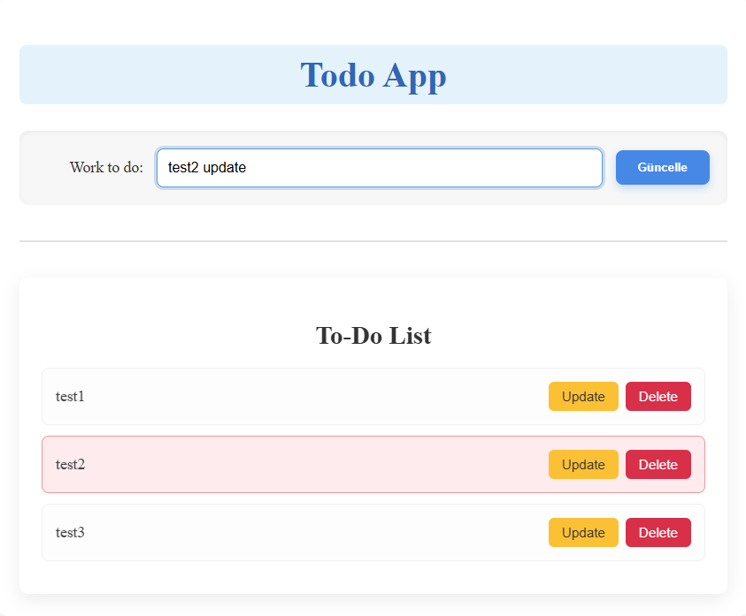

## Todo App
This is a simple web-based Todo application built with Angular. It allows users to manage their daily tasks efficiently.

## Features
Add Tasks: Quickly add new tasks to your todo list.

Update Tasks: Modify existing tasks. When a task is selected for update, its entry in the list will be highlighted in red.

Delete Tasks: Remove completed or unwanted tasks from the list.

## Technologies Used
Angular: A platform and framework for building single-page client applications using HTML and TypeScript.

HTML: For structuring the web content.

CSS: For styling the application, ensuring a clean and responsive user interface.

## How to Use
Enter Task: Type your task into the input field.

Save Task: Click the Save button to add the task to the list.

Update Task: Click the Update button next to a task to bring its content into the input field. Make your changes and click the "Güncelle" button again to save them. The selected task will be highlighted in red.

Delete Task: Click the Delete button next to a task to remove it from the list.

